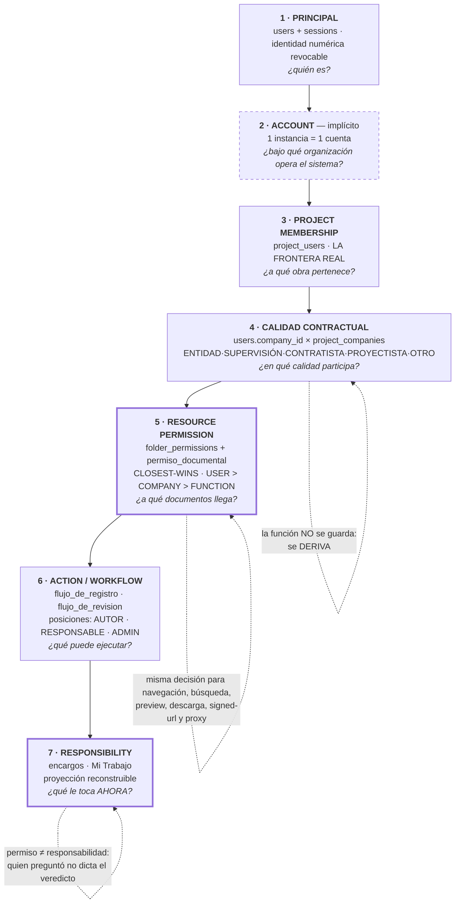
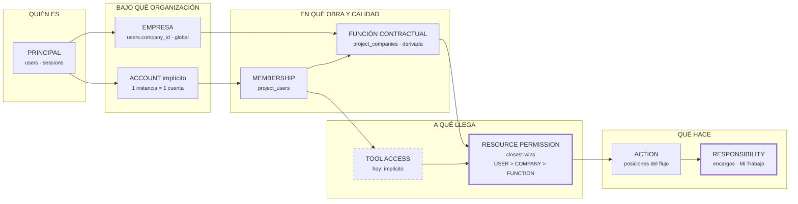

> ⚠️ **SUPERADO por [44-arquitectura-docs-rev02.md](44-arquitectura-docs-rev02.md).**
> Este documento contiene cinco afirmaciones corregidas allí: la creación de
> proyectos en ACC, la naturaleza del objeto `Role`, las Project Templates de
> ACC, la herencia de Documents en Procore, y dos decisiones nuestras
> (función contractual ≠ plantilla de permisos, y el disparador de Member
> Tool Access). Se conserva como registro de lo que se corrigió.

# ARQUITECTURA DOCS — ACC vs PROCORE vs NUESTRO ECD

**21-ago-2026** · Investigación. **No se implementó nada.**

Cada afirmación va marcada:
**[D]** documentado por el fabricante · **[I]** inferido de la documentación ·
**[N]** decisión nuestra.

Fuentes consultadas al final.

---

# 1 · ÁRBOL REAL — AUTODESK CONSTRUCTION CLOUD / DOCS

```
Autodesk ID                          identidad de la persona
   │
   ▼
ACC Account (Hub)                    la cuenta del cliente
   │  · Account Admin: crea proyectos, gestiona el directorio de
   │    cuenta (usuarios, EMPRESAS, ROLES), invita Project Admins   [D]
   │  · ve TODOS los proyectos, usuarios y empresas de la cuenta    [D]
   ▼
Project                              lo crea SOLO el Account Admin  [D]
   │
   ▼
Project Membership                   se añade a la persona al proyecto
   │  y en el mismo acto se le fija:                                 [D]
   │     · Company        (a qué empresa pertenece EN ESTE proyecto)
   │     · Role           (etiqueta de proyecto: Arquitecto, …)
   │     · Access level   → Project member | Project ADMIN
   ▼
Product Access                       POR MIEMBRO Y POR PRODUCTO      [D]
   │  Build · Cost · Design Collaboration · Model Coordination ·
   │  Takeoff · AutoSpecs · Data Management · Insight
   │  · «Data Management» (= Docs) e Insight se conceden POR DEFECTO [D]
   │  · quitar Data Management → «pierde acceso a TODOS los productos
   │    y se le ELIMINA del proyecto»                                [D]
   ▼
Folder Permission                    la capa de recurso
   │  Sujetos: USER · ROLE · COMPANY · «Everyone»                    [D]
   │  6 niveles, de menor a mayor:                                   [D]
   │     1 View only
   │     2 View + Download
   │     3 Upload only          (sube sin ver el contenido)
   │     4 View + Download + Upload
   │     5 View + Download + Upload + Edit
   │     6 Folder Control       (tareas normalmente de Project Admin)
   │  Herencia: la subcarpeta hereda del padre y, si se cambia,
   │  «debe IGUALAR o SUPERAR» el nivel del padre                    [D]
   ▼
Action dentro de Docs                ver · descargar · subir · editar · markup
```

## Lo que decide cada capa en ACC

| pregunta | la responde |
|---|---|
| ¿Existe esta persona? | Autodesk ID |
| ¿Pertenece a la cuenta? | Account members |
| ¿Está en la obra? | Project membership |
| ¿Puede abrir Docs? | Product Access (**Data Management**) |
| ¿Puede abrir ESTA carpeta? | Folder permission |
| ¿Puede editar el fichero? | El nivel de esa carpeta |

## Las tres reglas de ACC que más importan

**1 · El modelo es GRANT-ONLY.** Una subcarpeta **no puede restringir**: su
nivel debe igualar o superar al del padre **[D]**. Reservar una carpeta a quien
ya tiene acceso arriba **no es expresable**.

**2 · Las fuentes se ACUMULAN.** *«Quitar un permiso sólo afecta al acceso
concedido por ese tipo concreto —usuario, rol o empresa—. No afecta a los
permisos si además se han concedido por otros tipos.»* **[D]**

> ⚠️ **La documentación NO dice qué nivel gana** cuando una persona recibe
> permisos distintos por usuario, rol y empresa. **[D: ausencia comprobada]**
> Se infiere que **gana el mayor** —el modelo es aditivo en todo lo demás y no
> existe ninguna forma de negar— **[I]**.

**3 · El Project Admin atraviesa la capa de recurso.** Tiene permisos de
gestión **sobre todas las carpetas**, sin asignación explícita **[D]**.

---

# 2 · ÁRBOL REAL — PROCORE

```
Procore User                         identidad
   │
   ▼
Company (Company Directory)          la organización. Es EL nivel superior
   │  · herramientas DE EMPRESA: una sola instancia de cada una      [D]
   │  · Company Permissions Template → nivel por herramienta         [D]
   ▼
Project
   │
   ▼
Project Directory (membership)       a qué proyectos pertenece
   │  · se añade desde el directorio de EMPRESA o el de PROYECTO     [D]
   │  · lleva asociación a una empresa (Company)                     [D]
   ▼
Project Permissions — POR HERRAMIENTA                                [D]
   │  None · Read Only · Standard · Admin
   │  · `None` → «la herramienta NO será visible en su menú»         [D]
   │  · se asignan con un Project Permissions Template …
   │  · … o «Do Not Apply a Template» → nivel manual por herramienta [D]
   ▼
Granular Permissions                 «capa extra SOBRE el nivel general» [D]
   │  · sólo para Read Only y Standard. NO aplican a None ni a Admin [D]
   │  · ej.: «Access Private Folders and Files»                      [D]
   ▼
Documents — permiso de recurso                                       [D]
   │  · una carpeta o fichero es PÚBLICO o **Private** (binario)
   │  · si el padre es Private, TODO lo de dentro es Private
   │  · a lo Private llegan: usuarios `Admin` de Documents, o quien
   │    tenga el granular «Access Private Folders and Files», o quien
   │    esté en «Manage Permissions» de esa carpeta
   │  · sujetos: usuarios · **permission groups** · distribution groups
   │  · REQUISITO PREVIO: `Read Only`+ en la HERRAMIENTA Documents
   │  · hace falta estar en Manage Permissions de la carpeta **Y DE SU
   │    PADRE** → la cadena es un **AND**, no un «el más cercano gana»
   ▼
Role-based privileges                tercera capa, en registros concretos [D]
   │  ej.: «Accounting Approver». No va por plantillas.
   ▼
Action
```

## Las tres reglas de Procore que más importan

**1 · El acceso a la herramienta es una PUERTA previa.** Sin `Read Only`+ en
Documents, no se le puede ni conceder una carpeta **[D]**. Y con `None` la
herramienta **desaparece del menú** **[D]**.

**2 · El recurso es binario + lista.** No hay seis niveles por carpeta: hay
*público dentro de la herramienta* o *Private con lista de acceso* **[D]**. El
nivel de lo que puedes HACER con el documento lo pone la herramienta, no la
carpeta **[I]**.

**3 · La cadena es restrictiva (AND).** Hace falta permiso en la carpeta **y en
su padre** **[D]**. Es lo contrario de ACC.

**4 · Las plantillas son el instrumento normal, pero no obligatorio** — «Do Not
Apply a Template» deja los permisos manuales por herramienta **[D]**.

---

# 3 · MATRIZ DE ACCESO POR ESCENARIOS

| # | escenario | **ACC / Docs** | **Procore** | **Nuestro ECD hoy** |
|---|---|---|---|---|
| **1** | Existe en la organización, **no en la obra** | En el directorio de cuenta, **sin acceso** al proyecto **[D]** | En el Company Directory, **sin acceso** al proyecto **[D]** | En `users`, sin fila en `project_users` → **403** en todo. Probado |
| **2** | En la obra, **sin acceso a Docs** | Posible en teoría, pero quitar Data Management **le expulsa del proyecto** **[D]** → en la práctica no existe | Normal: `None` en Documents, la herramienta **no se ve** **[D]** | **No existe**: ser miembro implica poder usar todo |
| **3** | Acceso a Docs, **no a una carpeta** | Sí: sin permiso en esa carpeta **[D]** | Sí: carpeta `Private` y no está en su lista **[D]** | **Sí**: `none` en esa carpeta → 403 en las 6 puertas |
| **4** | Acceso **por Company** | Sí, sujeto de primera clase **[D]** | Vía **permission groups** **[D: grupos]** / **[I: no hay sujeto «empresa»]** | **Sí**: `sujeto_tipo = COMPANY` |
| **5** | Acceso **por Role** | Sí, sujeto de primera clase **[D]** | Vía permission groups, no por «rol» **[I]** | **Sí**, pero es **FUNCIÓN CONTRACTUAL** derivada de la empresa, no una etiqueta **[N]** |
| **6** | Acceso directo **como User** | Sí **[D]** | Sí **[D]** | Sí |
| **7** | **Dos permisos por dos fuentes** | Se **acumulan**; gana el mayor **[I]** | Grupos suman; la cadena padre-hijo **resta** (AND) **[D]** | **Gana el más específico del nivel más cercano**: `USER > COMPANY > FUNCTION` **[N]** |
| **8** | **Project Admin** ante carpeta restringida | **Entra**: tiene gestión sobre todas **[D]** | `Admin` en Documents **entra** en las Private **[D]** | Nuestro `admin` **entra**. Y **no existe** un admin *de obra* distinto |
| **9** | **Account/Company Admin** en obra donde **no participa** | Ve y administra **todos** los proyectos de la cuenta **[D]** | Depende de sus permisos de proyecto; el nivel de empresa no concede proyecto por sí solo **[I]** | Nuestro `admin` **entra en todo**, sin ser miembro |
| **10** | **Cambia su Company o Role** | Los permisos concedidos a la empresa/rol anterior **dejan de alcanzarle**; los del nuevo, sí **[I]** | Cambia de grupos → cambia el alcance **[I]** | **Igual, y en el acto**: la función se **deriva**, no se guarda. Probado |
| **11** | **Se le retira del proyecto** | Pierde el proyecto y sus productos **[D]** | Sale del Project Directory → sin acceso **[D]** | Pierde todo. Y sus objetos quedan **BLOQUEADO**, con salida controlada **[N]** |
| **12** | **Cambia una Permission Template** | **No aplica**: ACC no tiene plantillas de permisos de carpeta **[D: ausencia]** | Se puede reaplicar a los proyectos asignados; un usuario «sin plantilla» no se ve afectado **[D]** | **No aplica**: no tenemos plantillas **[N]** |

---

# 4 · DIFERENCIAS QUE IMPORTAN

| tema | ACC | Procore | ECD | veredicto |
|---|---|---|---|---|
| **Restringir una subcarpeta** | **Imposible** (debe igualar o superar) | Sí (Private + lista, AND con el padre) | **Sí** (closest-wins con `none`) | **MEJOR EN NUESTRO MODELO** |
| **Resolución de conflictos** | No documentada; aditiva | AND en la cadena | Precedencia **declarada y probada** | **MEJOR EN NUESTRO MODELO** |
| **Puerta de herramienta** | Product Access, pero Docs es de facto obligatorio | `None` oculta la herramienta | **No existe** | **DEUDA REAL** (acotada, ver §7) |
| **Admin de instancia vs de obra** | Account Admin / Project Admin **separados** | Company / Project separados | **Una sola palabra: `admin`** | **DEUDA REAL** |
| **Plantillas de permisos** | No las hay para carpetas | Centrales | No las hay | **COMPLEJIDAD ENTERPRISE QUE NO NECESITAMOS** |
| **Sujeto «empresa»** | Sí | No (grupos) | **Sí** | Empatados con ACC |
| **Función contractual** | No existe: `Role` es una etiqueta libre | No existe | **Derivada de (empresa, obra), lista cerrada con CHECK** | **DISTINTO PORQUE ES OBRA PÚBLICA** |
| **Responsabilidad / Ball-in-Court** | Vive dentro de cada flujo | Vive dentro de cada flujo | **Capa propia** (`encargos`), reconstruible e idempotente | **MEJOR EN NUESTRO MODELO** |
| **Niveles de carpeta** | 6 | binario + nivel de herramienta | 6 (heredados de ACC) | Empatados |
| **Estados CDE / idoneidad** | Suitability codes | Sin equivalente directo | WIP/SHARED/PUBLISHED + códigos | **DISTINTO PORQUE ES OBRA PÚBLICA** |

## Lo que ninguno de los dos tiene, y nosotros sí

**La función contractual como sujeto de permiso, derivada y no declarada.**
`ROLE` en ACC es texto libre que alguien teclea; nuestra `CONTRACTUAL_FUNCTION`
sale de `project_companies` con una lista cerrada. Que la Supervisión sea la
Supervisión no depende de que nadie lo escriba bien **[N]**.

---

# 5 · ÁRBOL OBJETIVO DE NUESTRO ECD

Sólo capas con **responsabilidad de autorización distinta**. Las decorativas se
marcan y se descartan.



## Capas que NO entran, y por qué

| capa | por qué no |
|---|---|
| **Account Membership / Roles** | Con una instancia por cliente, la cuenta **es** la instancia. Una tabla que siempre tiene una fila no autoriza nada |
| **Tool Activation** | Todas las obras de una entidad usan las mismas herramientas. Activar Reviews en unas y no en otras resuelve un problema que este cliente no tiene |
| **Permission Templates** | Con 4 papeles y 5 funciones contractuales, la plantilla **es** la función contractual. Ya la tenemos |
| **Role como etiqueta** | Sería un segundo nombre para la función contractual, y podría contradecirla |

---

# 6 · GAPS ACTUALES

| # | gap | qué problema real causa |
|---|---|---|
| **G1** | **`admin` significa tres cosas**: proveedor, entidad y proyecto | Un `admin` **lee cualquier obra sin ser miembro**. Con un solo cliente es tolerable —proveedor y entidad son la misma esfera de confianza—; con dos, no |
| **G2** | **No hay Member Tool Access** | Un tercero externo que deba ver documentos **y no** el registro de RFI no tiene cómo. Hoy se intentaría con permisos de carpeta, y los RFI no viven en carpetas |
| **G3** | **No hay UI para conceder por COMPANY o FUNCTION** | El modelo lo soporta y el backend lo aplica; la pantalla sigue siendo por persona. **Aditivo, no bloquea** |
| **G4** | **Sin Tool Activation** | Nadie puede decir «esta obra no usa Red Lines». **No crea deuda estructural** |
| **G5** | **`hubs` no autoriza nada** | Es una etiqueta de presentación con nombre de frontera. Confunde a quien lee el modelo |

---

# 7 · PRIORIDADES

| pieza | clasificación | qué problema resuelve |
|---|---|---|
| **Instance Admin vs Project Admin** (G1) | **ANTES DEL PRIMER CLIENTE EXTERNO** | Separa «administro mi obra» de «lo leo todo». **Las reglas de flujo ya están preparadas**: `ADMIN` es una *posición declarada*, no una consulta a `users.role` — cambiar qué significa es cambiar **una función** |
| **UI de permisos por COMPANY / FUNCTION** (G3) | **ANTES DEL PRIMER CLIENTE EXTERNO** | Sin ella, repartir una obra se hace persona a persona. El motor ya está |
| **Member Tool Access** (G2) | **ANTES DE MULTI-CLIENTE** | El tercero externo que ve documentos y no consultas. Aditivo: una tabla `(project_id, user_id, tool)` consultada en el middleware |
| **Tool Activation** (G4) | **DESPUÉS / ENTERPRISE** | Carteras heterogéneas. No toca permisos, usuarios ni proyectos |
| **Account Membership / Account Roles** | **NO IMPLEMENTAR** *(mientras sea una instancia por cliente)* | Resolvería la multi-tenencia, que hoy resuelve el despliegue |
| **Permission Templates** | **NO IMPLEMENTAR** | La función contractual ya hace de plantilla, y sin una segunda verdad que mantener |
| **`Role` como etiqueta libre** | **NO IMPLEMENTAR** | Duplicaría la función contractual pudiendo contradecirla |
| **Explicit deny separado** | **NO IMPLEMENTAR** | `none` en closest-wins ya niega, **y se lee mirando una sola carpeta** |
| **Aclarar `hubs`** (G5) | **DESPUÉS** | Documentar que es presentación, o retirarlo. Cosmético, pero engaña |

---

# 8 · QUÉ **NO** COPIAR

**De ACC:**

1. **La herencia grant-only.** Es su defecto, no su virtud: **impide reservar
   una carpeta**. Es exactamente lo que nosotros teníamos y acabamos de cerrar.
2. **Que quitar Docs expulse del proyecto.** Convierte el acceso a producto en
   un interruptor falso: parece una capa y no lo es.
3. **`Role` como texto libre** paralelo a la empresa.
4. **Que el Account Admin lo vea todo** sin ser miembro. Es nuestro G1, y en
   ACC es por diseño; en una plataforma que aloje a dos clientes, no vale.

**De Procore:**

5. **La cadena AND padre-hijo.** Obliga a conceder en cada nivel; olvidarse de
   uno deja al usuario fuera **sin decir por qué**.
6. **Las plantillas de permisos.** Con nuestra escala son una segunda verdad
   que hay que mantener sincronizada.
7. **Tres capas de permiso apiladas** (nivel + granular + rol en registro).
   Nadie sabrá explicar por qué alguien ve algo.
8. **El recurso binario** (público/Private). Perderíamos los seis niveles.

---

# 9 · EL ORGANIGRAMA DEFINITIVO



**Leyenda.** Línea discontinua = capa que **hoy no existe** y está clasificada.
Trazo grueso = donde vive la decisión.

> **La empresa entra por la izquierda y la obra por arriba: la función
> contractual es el punto donde se cruzan.** Ése es el hallazgo del modelo, y
> no lo tiene ninguno de los dos productos.

---

# 10 · RESPUESTA CORTA

> **No hay que copiar a ninguno de los dos en la capa de recurso: ahí estamos
> mejor.** ACC no puede reservar una carpeta y no documenta cómo resuelve un
> conflicto; Procore lo resuelve con tres capas apiladas y una cadena AND que
> nadie sabrá depurar.
>
> **Donde sí nos llevan ventaja es en la capa administrativa**, y por una razón
> concreta: los dos separan *administrar una obra* de *verlo todo*. Nosotros
> tenemos una sola palabra —`admin`— para tres cosas. Eso **no duele hoy**, con
> un cliente y una esfera de confianza, y **duele el primer día que haya dos**.

---

## Fuentes

**Autodesk** (documentación oficial, consultada 21-ago-2026):
- [Manage Folder Permissions](https://help.autodesk.com/view/DOCS/ENU/?guid=Folder_Permissions)
- [Folder Permissions — niveles](https://help.autodesk.com/cloudhelp/ENU/BIM360D-Document-Management/files/To-Work-with-Document-Management/To-Work-with-Folders/GUID-2643FEEF-B48A-45A1-B354-797DAD628C37.html)
- [Manage Project Members](https://help.autodesk.com/view/DOCS/ENU/?guid=Manage_Project_Members)
- [Manage Members / Product](https://help.autodesk.com/cloudhelp/ENU/Docs-Members/files/Manage_Members_Product.html)
- [About Account Administration and Project Administration](https://help.autodesk.com/cloudhelp/ENU/BIM-360-Field/files/GUID-7D522D38-4905-430C-856F-7C3A71F7B6C8.htm)
- [Roles (Account Admin)](https://help.autodesk.com/view/DOCS/ENU/?guid=Account_Admin_Roles)

**Procore** (documentación oficial, consultada 21-ago-2026):
- [What are permissions in Procore and how do they work?](https://support.procore.com/faq/what-are-permissions-in-procore-and-how-do-they-work)
- [Manage Permissions for Files and Folders in the Project Level Documents Tool](https://support.procore.com/products/online/user-guide/project-level/documents/tutorials/manage-permissions-for-files-and-folders-in-the-project-level-documents-tool)
- [Grant Granular Permissions in a Project Permissions Template](https://support.procore.com/products/online/user-guide/company-level/permissions/tutorials/grant-granular-permissions-in-a-project-permissions-template)
- [Create / Edit a Project Permissions Template](https://support.procore.com/products/online/user-guide/company-level/permissions/tutorials/create-a-project-permissions-template)
- [Add an Existing User to Projects](https://support.procore.com/products/online/user-guide/company-level/directory/tutorials/add-an-existing-user-to-projects-in-your-companys-procore-account)
- [Permissions Tool](https://support.procore.com/products/online/user-guide/company-level/permissions)

**Nuestro ECD:** `permiso_documental.py` · `folder_permissions.py` ·
`directorio_de_obra.py` · `encargos.py` · `flujo_de_registro.py` ·
[41-cierre-de-foundation-de-acceso.md](41-cierre-de-foundation-de-acceso.md)

---

**STOP.** No se implementó nada. No se tocó `frontend-react`, 3D, 4D, LOB,
Cost, Field ni Project Controls.
