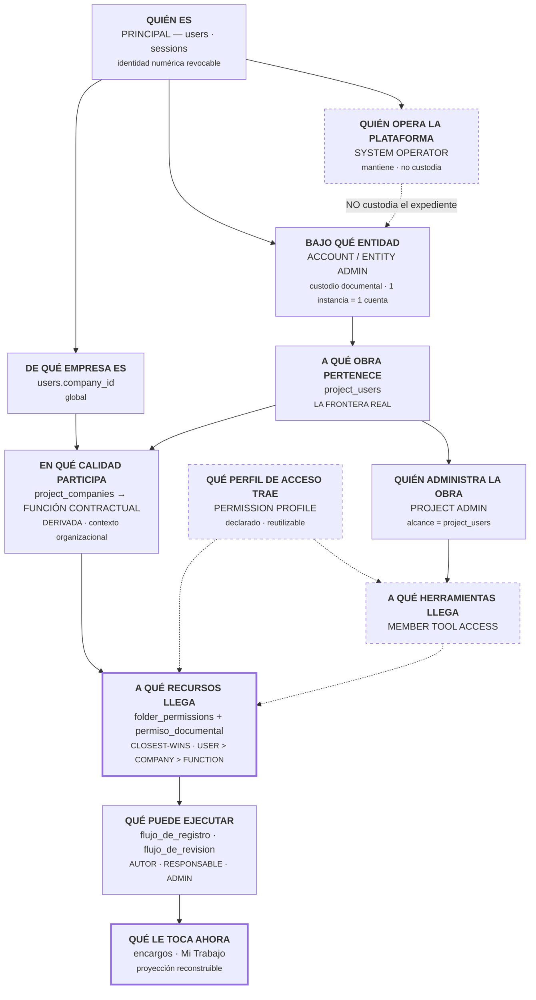

# ARQUITECTURA DOCS — ACC vs PROCORE vs ECD · REV.02

**21-ago-2026** · Sustituye a
[43-arquitectura-docs-acc-procore-ecd.md](43-arquitectura-docs-acc-procore-ecd.md).
**No se implementó nada.**

**[D]** documentado por el fabricante · **[I]** inferido · **[N]** decisión nuestra.

---

# 0 · LAS CINCO CORRECCIONES

| # | REV.01 decía | La documentación dice |
|---|---|---|
| **1** | «Los proyectos los crea SOLO el Account Admin» | **Falso.** Los **Project Admins crean proyectos y plantillas**; el Hub/Account Admin puede **quitarles** esa capacidad con un interruptor en Settings **[D]** |
| **2** | «`Role` es texto libre que alguien teclea» | **Falso.** Es un **objeto administrado** en Account Admin, con **nivel de acceso por defecto** y **acceso a productos**. Y *«quien tiene varios roles obtiene el acceso combinado»* **[D]** |
| **3** | «ACC no tiene plantillas de permisos» | **Impreciso.** ACC **sí** tiene **Project Templates** que estandarizan estructura de carpetas, miembros y productos. Lo que no tiene es la plantilla *por usuario* de Procore **[D]** |
| **4** | «Procore = AND padre-hijo» | **Reducción indebida.** El fabricante documenta **dos frases en tensión** y no enuncia ninguna regla **[D]** |
| **5** | «La función contractual ya hace de plantilla» / «Member Tool Access: antes de multi-cliente» | **Confusión conceptual** y **disparador equivocado**. Ver §6 **[N]** |

---

# 1 · ÁRBOL REAL — AUTODESK ACC / DOCS *(corregido)*

```
Autodesk ID
   │
   ▼
ACC Account (Hub)
   │
   ├─► ACCOUNT ADMIN ──────────────────────────────────────────────┐
   │      · directorio de cuenta: usuarios, EMPRESAS y ROLES  [D]  │
   │      · ve todos los proyectos, usuarios y empresas       [D]  │
   │      · INTERRUPTOR: puede impedir que los Project Admin       │
   │        creen proyectos y plantillas                      [D]  │
   │                                                                │
   ├─► ROLE  ── objeto administrado, NO una etiqueta ──────────────┤
   │      · se crea en Account Admin «para controlar el acceso     │
   │        a productos»                                      [D]  │
   │      · lleva **Default access level**:                   [D]  │
   │           Project member  |  Project administrator            │
   │      · se pueden crear roles PERSONALIZADOS              [D]  │
   │      · «quien tiene varios roles obtiene el acceso            │
   │        COMBINADO de todos»                               [D]  │
   │      · y además es SUJETO de permiso de carpeta          [D]  │
   │                                                                │
   ├─► PROJECT TEMPLATE ───────────────────────────────────────────┤
   │      · la crea el PROJECT ADMIN (salvo veto del Hub)     [D]  │
   │      · incluye: estructura de carpetas sugerida, miembros,    │
   │        productos y herramientas, formularios, informes   [D]  │
   │      · el vocabulario de plantilla define niveles de          │
   │        carpeta: VIEW · DOWNLOAD · PUBLISH · COLLABORATE ·     │
   │        EDIT · CONTROL                                    [D]  │
   ▼                                                                │
Project ◄───────────────────────────────────────────────────────────┘
   │  lo crea el Account Admin O un Project Admin no restringido [D]
   ▼
Project Membership          Company · Role · Access level      [D]
   ▼
Product Access              por miembro y por producto         [D]
   │  · Data Management (Docs) e Insight, por defecto          [D]
   │  · quitar Data Management → se le ELIMINA del proyecto    [D]
   │  · el ROL puede preconfigurarlo                           [D]
   ▼
Folder Permission           USER · ROLE · COMPANY · Everyone   [D]
   │  6 niveles · la subcarpeta debe IGUALAR o SUPERAR al padre [D]
   ▼
Action
```

## Qué cambia con las correcciones 1 y 2

**La creación de proyectos es una capacidad DELEGABLE, no una frontera.** El
árbol administrativo de ACC no es «una cúpula que crea y unos administradores
que operan»: es **un operador de cuenta que decide cuánta autonomía delega**, y
un interruptor que lo hace explícito **[D]**.

**`Role` en ACC es lo más parecido a un perfil de autorización reutilizable que
tiene el producto.** No es una etiqueta: preconfigura **qué productos** usa
quien lo lleva y **si entra como miembro o como administrador de proyecto**
**[D]**. Y es **sujeto de permiso de carpeta**. Es decir: **ACC sí tiene
estandarización de autorización — se llama `Role` y vive en la cuenta.**

## Qué cambia con la corrección 3

ACC tiene **dos mecanismos de estandarización distintos**, y confundirlos fue mi
error:

| | ACC | Procore |
|---|---|---|
| **Estandarizar el PROYECTO** | **Project Template**: carpetas, miembros, productos, formularios **[D]** | Project templates (de configuración) |
| **Estandarizar la AUTORIZACIÓN de una persona** | **Role** (nivel por defecto + productos) **[D]** | **Permissions Template** (nivel por herramienta) **[D]** |

Decir que «ACC carece de mecanismos para estandarizar permisos» era falso en las
dos columnas.

---

# 2 · ÁRBOL REAL — PROCORE

*(Sin cambios respecto a REV.01 salvo §2.1.)*

```
Procore User
   ▼
Company (Company Directory) ── Company Permissions Template ─► nivel por
   ▼                            herramienta de EMPRESA            [D]
Project
   ▼
Project Directory (membership) + asociación a una empresa         [D]
   ▼
Project Permissions POR HERRAMIENTA   None · Read Only · Standard · Admin [D]
   │  · vía Project Permissions Template … o «Do Not Apply a Template»,
   │    que deja el nivel manual por herramienta                  [D]
   │  · `None` → la herramienta NO aparece en su menú             [D]
   ▼
Granular Permissions   «capa extra SOBRE el nivel general»        [D]
   │  sólo para Read Only y Standard; no para None ni Admin       [D]
   ▼
Documents · permiso de recurso                                     [D]
   ▼
Role-based privileges  en registros concretos («Accounting Approver») [D]
```

## 2.1 · La herencia de Documents, **exactamente como la documenta Procore**

El fabricante enuncia **cuatro cosas distintas**, y **no** las unifica en una
regla. Textualmente **[D]**:

| # | frase documentada | qué gobierna |
|---|---|---|
| **a** | *«If a parent folder is marked as Private, all files or folders in that folder are automatically Private.»* | La **privacidad** se propaga hacia abajo |
| **b** | *«After a user has permissions to a parent folder, they will automatically have permissions to folders and files within that parent folder.»* | El **permiso concedido** se propaga hacia abajo |
| **c** | *«…you will need to select them in the Manage Permissions window for the file or folder **and** its parent folder.»* | Instrucción de conceder **en ambos niveles** |
| **d** | Usuarios `Admin` en Documents, **o** con el granular *«Access Private Folders and Files»*, alcanzan lo privado | Dos **atajos** que saltan la lista |

> **(b) y (c) están en tensión.** Si el permiso al padre ya se propaga
> automáticamente, (c) no debería hacer falta; y si (c) hace falta, (b) no es
> automático. **Procore no resuelve la contradicción en su documentación.**
> **[D: la tensión es de la fuente, no una lectura mía]**

**Lo que sí se puede afirmar sin interpretar:**

1. El acceso a la **herramienta** es requisito previo: sin `Read Only`+ en
   Documents **no se puede conceder** una carpeta **[D]**.
2. Lo privado tiene **tres vías de entrada**: `Admin` de la herramienta, el
   granular, o estar en la lista **[D]**.
3. La orientación operativa del fabricante es **conceder en la cadena
   completa** **[D]**.

**REV.01 lo redujo a «un AND». Eso era mío, no de Procore, y queda retirado.**

---

# 3 · MATRIZ DE ACCESO POR ESCENARIOS *(revisada)*

| # | escenario | **ACC / Docs** | **Procore** | **Nuestro ECD** |
|---|---|---|---|---|
| **1** | Existe en la organización, no en la obra | En el directorio de cuenta, sin acceso **[D]** | En el Company Directory, sin acceso **[D]** | En `users`, sin `project_users` → **403**. Probado |
| **2** | En la obra, sin acceso a Docs | Quitar Data Management **le expulsa del proyecto** **[D]** → no es una capa usable | Normal: `None` en Documents, no ve la herramienta **[D]** | **No existe** |
| **3** | Con Docs, sin una carpeta | Sí **[D]** | Sí: `Private` sin estar en la lista **[D]** | **Sí**: `none` → 403 en las 6 puertas |
| **4** | Por **Company** | Sujeto de primera clase **[D]** | Vía permission groups **[D]**; no hay sujeto «empresa» **[I]** | **Sí**: `sujeto_tipo = COMPANY` |
| **5** | Por **Role** | Sí — y el rol además fija productos y nivel por defecto **[D]** | Vía permission groups **[I]** | **Sí**, pero es **función contractual derivada**, no un perfil **[N]** |
| **6** | Como **User** | Sí **[D]** | Sí **[D]** | Sí |
| **7** | **Dos fuentes** | *«Varios roles → acceso combinado»* **[D]**. Entre user/role/company no lo documenta; se infiere el mayor **[I]** | Grupos suman; la cadena padre-hijo, sin regla enunciada **[D]** | **El más específico del nivel más cercano**: `USER > COMPANY > FUNCTION` **[N]** |
| **8** | **Project Admin** ante carpeta restringida | **Entra**: gestión sobre todas **[D]** | `Admin` de Documents entra en las Private **[D]** | Nuestro `admin` entra. **No hay admin de obra distinto** |
| **9** | **Account Admin** en obra donde no participa | Ve y administra todos los proyectos **[D]** | El nivel de empresa no concede proyecto por sí solo **[I]** | Nuestro `admin` **entra en todo** sin ser miembro |
| **10** | Cambia su Company o Role | Deja de alcanzarle lo del anterior **[I]**; si el rol traía productos, cambian **[D]** | Cambian sus grupos **[I]** | **En el acto**: la función se **deriva**. Probado |
| **11** | Se le retira del proyecto | Pierde proyecto y productos **[D]** | Sale del directorio **[D]** | Pierde todo; sus objetos quedan **BLOQUEADO** con salida controlada **[N]** |
| **12** | Cambia una plantilla | **Project Template** afecta a proyectos **nuevos**; no reescribe los existentes **[I]** | Se puede reaplicar a los proyectos asignados; «sin plantilla» no se ve afectado **[D]** | **No aplica**: no tenemos perfiles **[N]** |

---

# 4 · DIFERENCIAS QUE IMPORTAN *(revisadas)*

| tema | ACC | Procore | ECD | veredicto |
|---|---|---|---|---|
| **Restringir una subcarpeta** | **No puede** (debe igualar o superar) **[D]** | Sí (`Private` + lista) **[D]** | **Sí** (closest-wins con `none`) | **MEJOR EN NUESTRO MODELO** |
| **Regla de conflicto enunciada** | No, salvo «varios roles = combinado» **[D]** | No **[D]** | **Declarada y probada** | **MEJOR EN NUESTRO MODELO** |
| **Perfil de autorización reutilizable** | **Sí: `Role`** (productos + nivel por defecto) **[D]** | **Sí: Permissions Templates** **[D]** | **NO existe** | **DEUDA REAL** — ver §6.A |
| **Estandarizar un proyecto nuevo** | **Sí: Project Templates** **[D]** | Sí **[D]** | No | **TRIGGER FUTURO** |
| **Puerta de herramienta** | Product Access, pero Docs es de facto obligatorio **[D]** | `None` oculta la herramienta **[D]** | **No existe** | **DEUDA REAL** — ver §6.B |
| **Tres niveles de administración** | Account ≠ Project, con **delegación explícita** **[D]** | Company ≠ Project **[D]** | **Una sola palabra: `admin`** | **DEUDA REAL** — ver §5 |
| **Función contractual** | No existe | No existe | **Derivada de (empresa, obra), lista cerrada** | **DISTINTO PORQUE ES OBRA PÚBLICA** |
| **Responsibility / Ball-in-Court** | Dentro de cada flujo | Dentro de cada flujo | **Capa propia**, reconstruible e idempotente | **MEJOR EN NUESTRO MODELO** |
| **Capas apiladas de permiso** | 1 (carpeta) | 3 (nivel + granular + rol en registro) **[D]** | 1 (carpeta) | **COMPLEJIDAD QUE NO NECESITAMOS** |

---

# 5 · EL MODELO ADMINISTRATIVO OBJETIVO — TRES FIGURAS, NO UNA

Los dos productos separan la administración. Nosotros tenemos **una palabra
para tres papeles**, y son papeles con **responsabilidades y riesgos
distintos** **[N]**:

```
┌──────────────────────────────────────────────────────────────────┐
│  SYSTEM / PLATFORM OPERATOR                                      │
│  Quien MANTIENE la plataforma: despliegues, esquema, copias,      │
│  rotación de credenciales, incidentes.                            │
│  NO es el custodio del expediente. No debería necesitar leer      │
│  documentos contractuales para hacer su trabajo.                  │
├──────────────────────────────────────────────────────────────────┤
│  ACCOUNT / ENTITY ADMIN                                          │
│  El CUSTODIO DOCUMENTAL de la entidad. Crea obras, decide         │
│  quién participa y en qué empresa, y responde del expediente      │
│  ante un tercero. Es una figura CONTRACTUAL, no técnica.          │
├──────────────────────────────────────────────────────────────────┤
│  PROJECT ADMIN                                                   │
│  Administra UNA obra: directorio, permisos de carpeta,            │
│  desatascar flujos. Su alcance termina en `project_users`.        │
└──────────────────────────────────────────────────────────────────┘
```

> **El operador de plataforma no es el custodio documental.** Hoy el mismo
> `role = 'admin'` es las tres cosas: quien redespliega Render puede leer
> cualquier contrato de cualquier obra sin ser miembro. **Con un cliente y una
> sola esfera de confianza es tolerable. No lo es en cuanto el expediente tenga
> que defenderse ante un tercero**, porque «¿quién pudo ver esto?» no tiene
> respuesta acotada.

**Para V1 sigue valiendo `1 instancia = 1 Account implícito`.** Lo que **no**
sigue valiendo es que las tres figuras compartan la misma palabra **[N]**.

Y hay una lección de ACC que aplica directamente: **la creación de proyectos es
delegable con un interruptor** **[D]**. La separación no tiene por qué ser
rígida — tiene que ser **explícita**.

---

# 6 · LAS DOS CORRECCIONES DE NUESTRAS PROPIAS DECISIONES

## 6.A · `CONTRACTUAL_FUNCTION` **no** es una Permission Template

REV.01 dijo: *«la plantilla es la función contractual. Ya la tenemos.»**
**Es un error conceptual y lo retiro** **[N]**.

| | **Función contractual** | **Perfil / plantilla de autorización** |
|---|---|---|
| **Qué es** | **Contexto organizacional**: en qué calidad participa una empresa en una obra | **Autorización reutilizable**: qué puede hacer quien lo lleve |
| **De dónde sale** | Se **DERIVA** de `(empresa, obra)`. Nadie la teclea | Se **DECLARA** y se aplica a personas |
| **Cambia cuando** | Cambia el contrato | Cambia la política de acceso |
| **Analogía ACC** | *ninguna* | **`Role`** |

**Que hoy la usemos como sujeto de permiso no la convierte en un perfil.** Son
dos ejes: uno dice *quién eres en esta obra*, el otro *qué se te concede por
defecto*. Que coincidan a menudo es una comodidad, no una identidad.

> **Podemos diferir los perfiles. No podemos decir que ya los tenemos.**

Consecuencia práctica: cuando llegue el momento de un perfil reutilizable —«todo
supervisor nuevo entra con esto»— **no habrá que reinterpretar la función
contractual**: será una tabla aparte, y la función seguirá diciendo lo que dice.

## 6.B · Member Tool Access — el disparador correcto

REV.01 lo clasificó *«antes de multi-cliente»*. **Mal** **[N]**. El disparador
no es cuántos clientes hay: es **quién entra en la obra**.

> ### `ANTES DEL PRIMER PARTICIPANTE EXTERNO DE ACCESO LIMITADO`

Un auditor, un subcontratista o un supervisor externo puede necesitar
**Documents y no RFI**, **con un solo cliente y una sola obra**. Y hoy eso no se
puede expresar: **los RFI y los Red Lines no viven en carpetas**, así que el
permiso de carpeta —por bueno que sea— no los alcanza.

Es el mismo razonamiento de Procore, donde `None` en una herramienta la retira
del menú **[D]**. La diferencia es que ellos lo tienen y nosotros no.

---

# 7 · EL ORGANIGRAMA DEFINITIVO



**Leyenda.** Discontinuo = **no existe todavía**. Trazo grueso = donde vive la
decisión.

**Nueve capas, y cada una responde algo que ninguna otra responde.** La que
más costó justificar es `PERMISSION PROFILE`: entra **separada** de la función
contractual precisamente por §6.A — y entra **discontinua**, porque hoy no está.

---

# 8 · MATRIZ DE PRIORIDADES

## `IMPLEMENTAR AHORA`

| pieza | problema real que resuelve |
|---|---|
| *(ninguna)* | El acceso documental quedó cerrado y probado. **Nada de lo que falta bloquea el uso con el cliente actual**, y meter una capa sin caso de uso es cómo se llega a un modelo que nadie sabe explicar |

## `ANTES DEL PILOTO EXTERNO`

| pieza | problema real |
|---|---|
| **Separar `SYSTEM OPERATOR` / `ENTITY ADMIN` / `PROJECT ADMIN`** | Hoy quien redespliega puede leer cualquier contrato. Ante un tercero, «¿quién pudo ver esto?» no tiene respuesta acotada. **Barato ahora**: `ADMIN` ya es una *posición declarada* en los flujos, no una consulta a `users.role` |
| **UI de permisos por `COMPANY` y `FUNCTION`** | El motor está construido y probado; sin pantalla, repartir una obra se hace persona a persona. Es exponer lo que ya existe |

## `TRIGGER FUTURO` — con el disparador escrito

| pieza | **disparador** |
|---|---|
| **Member Tool Access** | **El primer participante externo de acceso limitado** — auditor, subcontratista o supervisor que necesite Documents y no RFI. **Puede ocurrir con un solo cliente** |
| **Permission Profiles** | Cuando repartir permisos persona a persona empiece a dar errores: **más de ~3 obras vivas** o el primer «que entre con lo mismo que el anterior» |
| **Project Templates** | La **segunda obra que se cree copiando la estructura de la primera** a mano |
| **Account Membership / Roles** | El **segundo cliente en la misma instancia**. Mientras sea una instancia por cliente, no autoriza nada |
| **Tool Activation por obra** | La primera cartera con obras que **no usan las mismas herramientas** |

## `NO NECESARIO`

| pieza | por qué |
|---|---|
| **Explicit deny separado** | `none` en closest-wins ya niega, **y se lee mirando una sola carpeta** |
| **Herencia grant-only de ACC** | Es su limitación, no su virtud: impide reservar una carpeta |
| **Cadena de concesión en cada nivel (Procore)** | Olvidar un nivel deja al usuario fuera **sin decir por qué** |
| **Tres capas apiladas de permiso (Procore)** | Nadie sabrá explicar por qué alguien ve algo |
| **Recurso binario público/privado (Procore)** | Perderíamos los seis niveles |
| **`Role` como etiqueta libre** | En ACC **no lo es**; copiar la versión degradada sería lo peor de ambos |
| **Que quitar Docs expulse del proyecto (ACC)** | Convierte una capa en un interruptor falso |

---

# 9 · RESPUESTA CORTA

> **En la capa de recurso seguimos por delante**, y las correcciones no lo
> cambian: ACC no puede reservar una subcarpeta y Procore no enuncia su propia
> regla de herencia.
>
> **Donde estaba equivocado era en la capa administrativa.** ACC no tiene una
> cúpula que lo crea todo: tiene **delegación explícita con un interruptor**. Y
> su `Role` **no es una etiqueta**: es el perfil de autorización reutilizable
> que nosotros **no tenemos y habíamos dado por cubierto** con la función
> contractual. No lo está: una dice *quién eres en esta obra*, el otro *qué se
> te concede*.
>
> **Nada de esto bloquea hoy.** Lo que sí conviene antes del primer piloto
> externo es dejar de llamar `admin` a tres figuras distintas — sobre todo a la
> que mantiene la plataforma, que **no debería necesitar leer un contrato para
> hacer su trabajo**.

---

## Fuentes

**Autodesk** (oficial, consultada 21-ago-2026):
- [Manage Folder Permissions](https://help.autodesk.com/view/DOCS/ENU/?guid=Folder_Permissions)
- [Folder Permissions — niveles](https://help.autodesk.com/cloudhelp/ENU/BIM360D-Document-Management/files/To-Work-with-Document-Management/To-Work-with-Folders/GUID-2643FEEF-B48A-45A1-B354-797DAD628C37.html)
- [Roles](https://help.autodesk.com/cloudhelp/ENU/Docs-Admin/files/account-administration/Account_Admin_Roles.html)
- [Manage Project Members](https://help.autodesk.com/view/DOCS/ENU/?guid=Manage_Project_Members)
- [Create Project Templates](https://help.autodesk.com/cloudhelp/ENU/Docs-Admin/files/project-administration/about-templates/Templates_Create.html)
- [Configure Project Templates](https://help.autodesk.com/cloudhelp/ENU/Docs-Admin/files/project-administration/about-templates/Configure_Templates.html)
- [Create and Manage Projects](https://help.autodesk.com/cloudhelp/ENU/Docs-Admin/files/account-administration/Create_Manage_Projects.html)
- [Account Administration](https://help.autodesk.com/cloudhelp/ENU/Docs-Admin/files/Account_Administration.html)

**Procore** (oficial, consultada 21-ago-2026):
- [What are permissions in Procore and how do they work?](https://support.procore.com/faq/what-are-permissions-in-procore-and-how-do-they-work)
- [Change Permission Settings on a Folder or File — Documents](https://support.procore.com/products/online/user-guide/project-level/documents/tutorials/change-permission-settings-on-a-folder-or-file-in-the-project-level-documents-tool)
- [Manage Permissions for Files and Folders — Documents](https://support.procore.com/products/online/user-guide/project-level/documents/tutorials/manage-permissions-for-files-and-folders-in-the-project-level-documents-tool)
- [Grant Granular Permissions in a Project Permissions Template](https://support.procore.com/products/online/user-guide/company-level/permissions/tutorials/grant-granular-permissions-in-a-project-permissions-template)
- [Create a Project Permissions Template](https://support.procore.com/products/online/user-guide/company-level/permissions/tutorials/create-a-project-permissions-template)
- [Permissions Tool](https://support.procore.com/products/online/user-guide/company-level/permissions)

**Nuestro ECD:** `permiso_documental.py` · `folder_permissions.py` ·
`directorio_de_obra.py` · `encargos.py` · `flujo_de_registro.py` ·
[41-cierre-de-foundation-de-acceso.md](41-cierre-de-foundation-de-acceso.md)

---

**STOP.** No se implementó nada.
